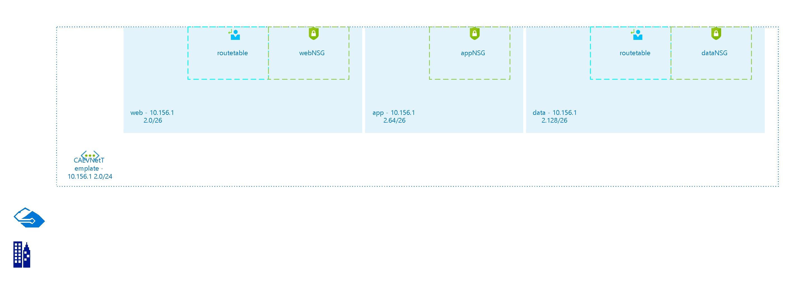

# CAEVNetTemplate
 
## Settings

| Name | CAEVNetTemplate  |
| --- | --- |
| Address Space | 10.156.12.0/24  |
| Location | canadaeast  |
| Provisioning State | Succeeded  |
| State |   |

## Subnets

## Subnet web

### Settings

| Adress Prefix | 10.156.12.0/26  |
| --- | --- |
| Network Security Group | [webNSG](webNSG--2145745860.md)  |
| Route Table | [routetable](routetable--496314456.md)  |

 
## Subnet app

### Settings

| Adress Prefix | 10.156.12.64/26  |
| --- | --- |
| Network Security Group | [appNSG](appNSG-351641189.md)  |
| Route Table |   |

 
## Subnet data

### Settings

| Adress Prefix | 10.156.12.128/26  |
| --- | --- |
| Network Security Group | [dataNSG](dataNSG-1352080205.md)  |
| Route Table | [routetable](routetable--496314456.md)  |

 

## Billing
 Total cost : 
