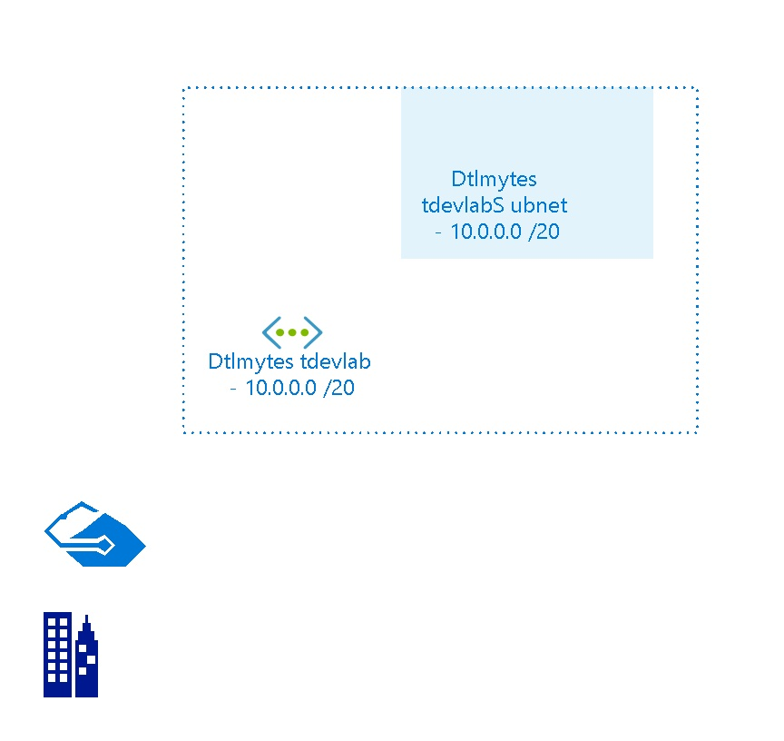

# Dtlmytestdevlab
 
## Settings

| Name | Dtlmytestdevlab  |
| --- | --- |
| Address Space | 10.0.0.0/20  |
| Location | canadaeast  |
| Provisioning State | Succeeded  |
| State |   |

## Tags

| Tag Key | Tag Value |
| --- | --- |
| hidden-DevTestLabs-LabUId  | e957db27-7670-499e-977d-643e22743653  |

## Subnets

## Subnet DtlmytestdevlabSubnet

### Settings

| Adress Prefix | 10.0.0.0/20  |
| --- | --- |
| Network Security Group |   |
| Route Table |   |

 

## Billing
 Total cost : 
