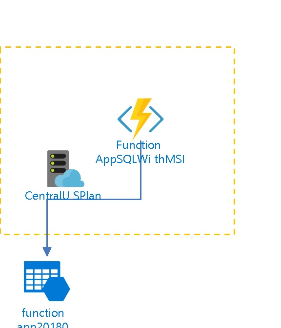

# FunctionAppSQLWithMSI 
  
## Settings

| Web Site State | Running  |
| --- | --- |
| Always On | False  |
| Load Balancing | LeastRequests  |
| Nb of workers | 1  |
| Auto Swap Slot Name |   |
| Enabled | True  |
| GatewaySiteName |   |
| Location | Central US  |
| Outbound Ip Addresses | 52.165.237.15,52.176.40.118,52.173.189.70,52.173.190.78,52.173.187.200  |
| Premium App Deployed |   |
| Virtual Network Name |   |
| Repository Site Name | FunctionAppSQLWithMSI  |
| Scm Site Stopped | False  |
| Use 32 Bits Worker Process | True  |

## App Service Plan
 

| Service Plan Name |   |
| --- | --- |
| Application Service Environment |   |
| Geographical Location | Central US  |
| Maximum Number Of Workers | 0  |
| Number Of Sites | 3  |
| Per Site Scaling enabled | False  |
| Status | Ready  |
| Sku Name | Y1  |
| Sku Tier | Dynamic  |
| Sku Family | Y  |
| Sku Capacity | 0  |
| Sku Size | Y1  |

## Tags

| Tag Key | Tag Value |
| --- | --- |
| hidden-related:/subscriptions/275ddf79-b240-44e7-9916-f24175b451b1/resourceGroups/sampletestfunctionapppascal/providers/Microsoft.Web/serverfarms/CentralUSPlan  | empty  |

## Site diagnostics
The site diagnostics options have been configured as follows.

| Request Tracing Enabled | False  |
| --- | --- |
| Detailed logging enabled | False  |
| Remote Debugging Enabled | False  |
| Remote Debugging Version |   |

## Functions
The following Functions are deployed in the App Service.
## FunctionAppSQLWithMSI/Function1

The following Proxies are deployed in the App Service.

## Default documents
The following default documents are defined.
- Default.htm

- Default.html

- Default.asp

- index.htm

- index.html

- iisstart.htm

- default.aspx

- index.php

## Host Names
The following Host Names are defined.
- functionappsqlwithmsi.azurewebsites.net

- functionappsqlwithmsi.scm.azurewebsites.net

## Metrics

## Average Response Time
 
## Requests
 
## Architecture diagram
 

## Billing
 Total cost : 
