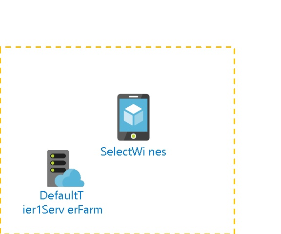

# SelectWines 
  
## Settings

| Web Site State | Running  |
| --- | --- |
| Always On | False  |
| Load Balancing | LeastRequests  |
| Nb of workers | 1  |
| Auto Swap Slot Name |   |
| Enabled | True  |
| GatewaySiteName |   |
| Location | East US  |
| Outbound Ip Addresses | 104.45.138.197,104.45.142.87,104.45.128.144,104.45.142.131  |
| Premium App Deployed |   |
| Virtual Network Name |   |
| Repository Site Name | SelectWines  |
| Scm Site Stopped | False  |
| Use 32 Bits Worker Process | True  |

## App Service Plan
 

| Service Plan Name |   |
| --- | --- |
| Application Service Environment |   |
| Geographical Location | East US  |
| Maximum Number Of Workers | 1  |
| Number Of Sites | 1  |
| Per Site Scaling enabled | False  |
| Status | Ready  |
| Sku Name | F1  |
| Sku Tier | Free  |
| Sku Family | F  |
| Sku Capacity | 0  |
| Sku Size | F1  |

## Site diagnostics
The site diagnostics options have been configured as follows.

| Request Tracing Enabled | False  |
| --- | --- |
| Detailed logging enabled | False  |
| Remote Debugging Enabled | False  |
| Remote Debugging Version | VS2012  |

## Functions
The following Functions are deployed in the App Service.
The following Proxies are deployed in the App Service.

## Host Names
The following Host Names are defined.
- selectwines.azure-mobile.net

- selectwines.scm.azure-mobile.net

## Metrics

## Average Response Time
 
## Requests
 
## Architecture diagram
 

## Billing
 Total cost : 
