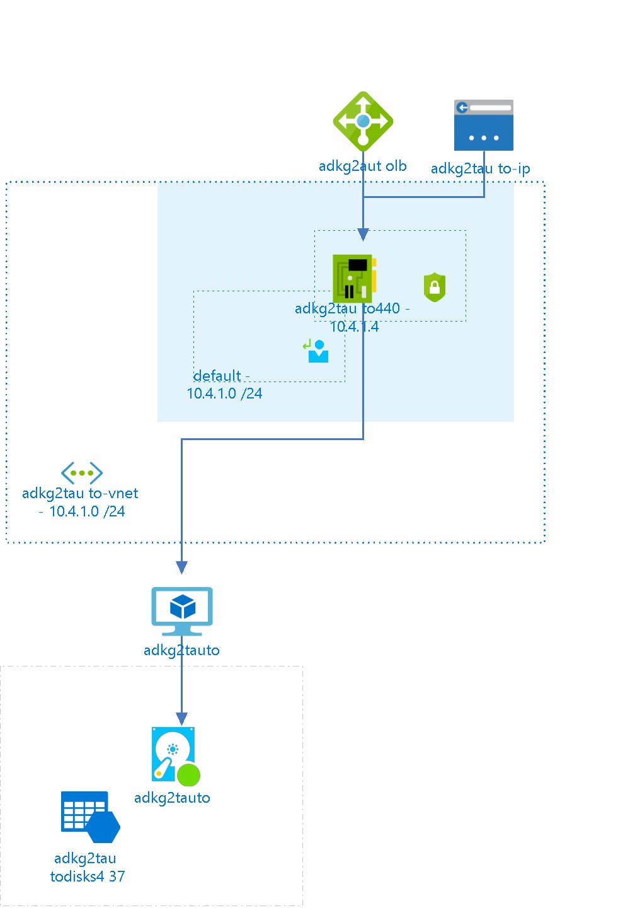

# adkg2tauto
 
## Settings
The virtual machine adkg2tauto has the following settings:

| Name | adkg2tauto  |
| --- | --- |
| Operating System | WindowsServer  |
| Location | eastus2  |
| Size | Standard_B2s <passthrough><ul><li>Number Of Cores : 2</li><li>Memory (MB): 4096</li><li>Max Data Disk Count: 4</li><li>OS Disk Size (MB) : 1047552</li><li>Resource Disk Size (MB) : 8192</li></ul></passthrough> |
| --- | --- |
| Availability Set |   |
| Fault Domain |   |
| Update Domain |   |
| State | VM deallocated  |
| Diagnostic Storage |   |
| Provisioning Date | 11/22/2017 3:21:03 PM  |
| Last Patch Date |   |
| Resource Group | [adkg2tauto](adkg2tauto-2034839542.md)  |
| Auto Update Status |   |

## Network interfaces

## adkg2tauto440

### Settings

| Name | adkg2tauto440  |
| --- | --- |
| Is primary | True  |
| Provisioning State | Succeeded  |
| Network Security Group | [adkg2tauto-nsg](adkg2tauto-nsg--63367424.md)  |
| Enable IP Forwarding | False  |
| Location | eastus2  |
| Mac Address |   |

### IP Configurations

| Public IP | Private IP | Subnet Name |
| --- | --- | --- |
|   | 10.4.1.4  | default  |
 
## Load Balancers

## adkg2autolb

### Settings

| Name | adkg2autolb  |
| --- | --- |
| Location | eastus2  |
| Provisioning State | Succeeded  |

### Inbound NAT Rules

| Name | Protocol | BackendPort | Front End Port | Enable Floating IP |
| --- | --- | --- | --- | --- |
| natrule  | Tcp  | 3389  | 443  | False  |

## Virtual Disks
The Virtual Machine is using the following disks

## OS Hard Disks

| Name | VHD Uri | Size (GB) | Is Managed Disk | Host Caching |
| --- | --- | --- | --- | --- |
| adkg2tauto  | https://adkg2tautodisks437.blob.core.windows.net/vhds/adkg2tauto20170613134659.vhd  | 127  | False  | ReadWrite  |

## Metrics

## Processor Time
 
## Available Bytes
  

## Billing
 Total cost : 
