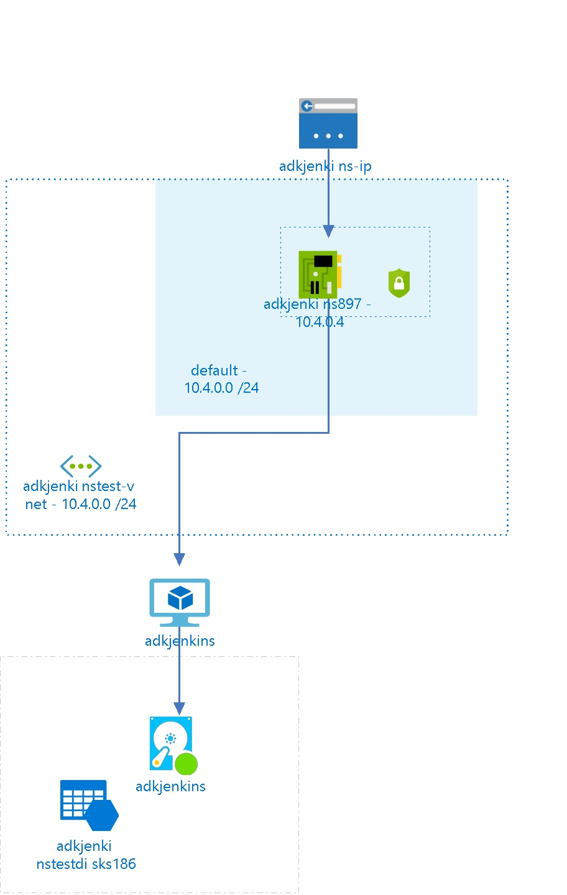

# adkjenkins
 
## Settings
The virtual machine adkjenkins has the following settings:

| Name | adkjenkins  |
| --- | --- |
| Operating System | Windows  |
| Location | eastus  |
| Size | Standard_DS2_v2 <passthrough><ul><li>Number Of Cores : 2</li><li>Memory (MB): 7168</li><li>Max Data Disk Count: 8</li><li>OS Disk Size (MB) : 1047552</li><li>Resource Disk Size (MB) : 14336</li></ul></passthrough> |
| --- | --- |
| Availability Set |   |
| Fault Domain |   |
| Update Domain |   |
| State | VM deallocated  |
| Diagnostic Storage |   |
| Provisioning Date | 2/7/2018 7:36:01 PM  |
| Last Patch Date |   |
| Resource Group | [adkjenkinstest](adkjenkinstest-364108532.md)  |
| Auto Update Status |   |

## Network interfaces

## adkjenkins897

### Settings

| Name | adkjenkins897  |
| --- | --- |
| Is primary | True  |
| Provisioning State | Succeeded  |
| Network Security Group | [adkjenkins-nsg](adkjenkins-nsg--1714832004.md)  |
| Enable IP Forwarding | False  |
| Location | eastus  |
| Mac Address |   |

### IP Configurations

| Public IP | Private IP | Subnet Name |
| --- | --- | --- |
|   | 10.4.0.4  | default  |
 

## Virtual Disks
The Virtual Machine is using the following disks

## OS Hard Disks

| Name | VHD Uri | Size (GB) | Is Managed Disk | Host Caching |
| --- | --- | --- | --- | --- |
| adkjenkins  | https://adkjenkinstestdisks186.blob.core.windows.net/vhds/adkjenkins20170303134758.vhd  | 127  | False  | ReadWrite  |

## Metrics

## Processor Time
 
## Available Bytes
  

## Billing
 Total cost : 
