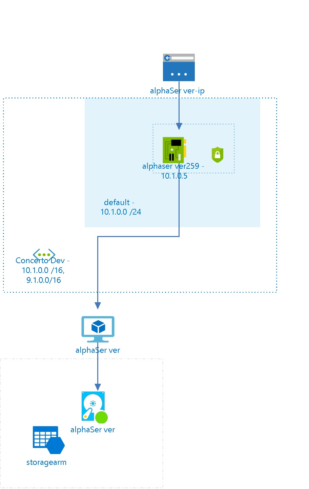

# alphaServer
 
## Settings
The virtual machine alphaServer has the following settings:

| Name | alphaServer  |
| --- | --- |
| Operating System | WindowsServer  |
| Location | eastus  |
| Size | Basic_A1 <passthrough><ul><li>Number Of Cores : 1</li><li>Memory (MB): 1792</li><li>Max Data Disk Count: 2</li><li>OS Disk Size (MB) : 1047552</li><li>Resource Disk Size (MB) : 40960</li></ul></passthrough> |
| --- | --- |
| Availability Set |   |
| Fault Domain |   |
| Update Domain |   |
| State | VM deallocated  |
| Diagnostic Storage |   |
| Provisioning Date | 9/6/2017 4:20:09 AM  |
| Last Patch Date |   |
| Resource Group | [ConcertoDev](ConcertoDev--200931608.md)  |
| Auto Update Status |   |

## Network interfaces

## alphaserver259

### Settings

| Name | alphaserver259  |
| --- | --- |
| Is primary | True  |
| Provisioning State | Succeeded  |
| Network Security Group | [alphaServer-nsg](alphaServer-nsg-1629721120.md)  |
| Enable IP Forwarding | False  |
| Location | eastus  |
| Mac Address |   |

### IP Configurations

| Public IP | Private IP | Subnet Name |
| --- | --- | --- |
|   | 10.1.0.5  | default  |
 

## Virtual Disks
The Virtual Machine is using the following disks

## OS Hard Disks

| Name | VHD Uri | Size (GB) | Is Managed Disk | Host Caching |
| --- | --- | --- | --- | --- |
| alphaServer  | https://storagearm.blob.core.windows.net/vhds/alphaServer2016829161712.vhd  |   | False  | ReadWrite  |

## Metrics

## Processor Time
 
## Available Bytes
  

## Billing
 Total cost : 
