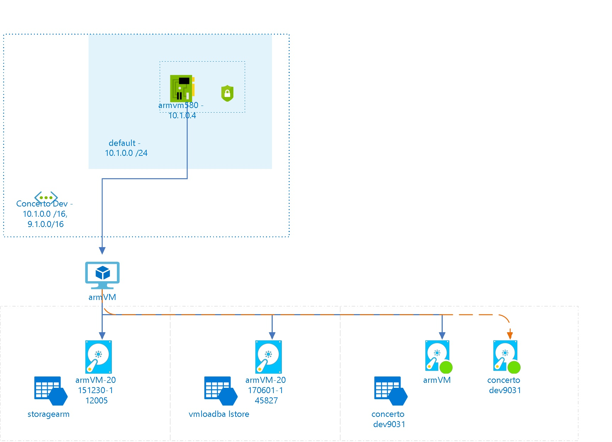

# armVM
 
## Settings
The virtual machine armVM has the following settings:

| Name | armVM  |
| --- | --- |
| Operating System | WindowsServer  |
| Location | eastus  |
| Size | Standard_DS2 <passthrough><ul><li>Number Of Cores : 2</li><li>Memory (MB): 7168</li><li>Max Data Disk Count: 8</li><li>OS Disk Size (MB) : 1047552</li><li>Resource Disk Size (MB) : 14336</li></ul></passthrough> |
| --- | --- |
| Availability Set |   |
| Fault Domain |   |
| Update Domain |   |
| State | VM deallocated  |
| Diagnostic Storage | [concertodev9031](concertodev9031--413511514.md)  |
| Provisioning Date | 9/6/2017 4:20:08 AM  |
| Last Patch Date |   |
| Resource Group | [ConcertoDev](ConcertoDev--200931608.md)  |
| Auto Update Status |   |

## Tags

| Tag Key | Tag Value |
| --- | --- |
| tag1  | value1  |
| tag2  | value2  |
| a  | AzureV1  |
| aDK_Billing  | Finance Department  |
 
## Network interfaces

## armvm580

### Settings

| Name | armvm580  |
| --- | --- |
| Is primary | True  |
| Provisioning State | Succeeded  |
| Network Security Group | [armVM](armVM--1144367662.md)  |
| Enable IP Forwarding | False  |
| Location | eastus  |
| Mac Address |   |

### IP Configurations

| Public IP | Private IP | Subnet Name |
| --- | --- | --- |
|   | 10.1.0.4  | default  |
 

## Virtual Disks
The Virtual Machine is using the following disks
## Data Hard Disks

| Name | VHD Uri | Size (GB) | Is Managed Disk | Host Caching |
| --- | --- | --- | --- | --- |
| armVM-20151230-112005  | https://storagearm.blob.core.windows.net/blb1/armVM-20151230-112005.vhd  | 2  | False  | None  |
| armVM-20170601-145827  | https://vmloadbalstore.blob.core.windows.net/vhds/armVM-20170601-145827.vhd  | 1  | False  | None  |

## OS Hard Disks

| Name | VHD Uri | Size (GB) | Is Managed Disk | Host Caching |
| --- | --- | --- | --- | --- |
| armVM  | https://concertodev9031.blob.core.windows.net/vhds/armVM.vhd  |   | False  | ReadWrite  |

## Metrics

## Processor Time
 
## Available Bytes
  

## Billing
 Total cost : 
