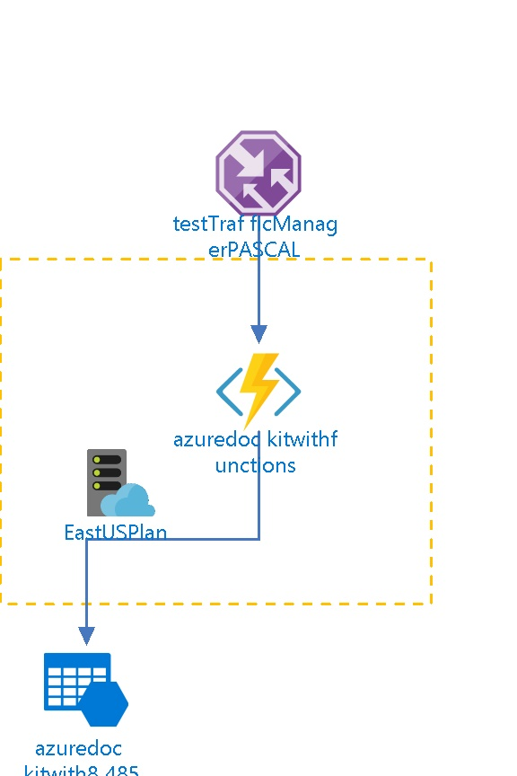

# azuredockitwithfunctions 
  
## Settings

| Web Site State | Running  |
| --- | --- |
| Always On | False  |
| Load Balancing | LeastRequests  |
| Nb of workers | 1  |
| Auto Swap Slot Name |   |
| Enabled | True  |
| GatewaySiteName |   |
| Location | East US  |
| Outbound Ip Addresses | 191.238.32.104,191.238.32.154,191.238.34.67,191.238.35.12,168.62.174.199,23.96.6.200,23.96.2.128,23.96.5.238  |
| Premium App Deployed |   |
| Virtual Network Name |   |
| Repository Site Name | azuredockitwithfunctions  |
| Scm Site Stopped | False  |
| Use 32 Bits Worker Process | True  |

## App Service Plan
 

| Service Plan Name |   |
| --- | --- |
| Application Service Environment |   |
| Geographical Location | East US  |
| Maximum Number Of Workers | 0  |
| Number Of Sites | 1  |
| Per Site Scaling enabled | False  |
| Status | Ready  |
| Sku Name | Y1  |
| Sku Tier | Dynamic  |
| Sku Family | Y  |
| Sku Capacity | 0  |
| Sku Size | Y1  |

## Site diagnostics
The site diagnostics options have been configured as follows.

| Request Tracing Enabled | False  |
| --- | --- |
| Detailed logging enabled | False  |
| Remote Debugging Enabled | False  |
| Remote Debugging Version |   |

## Functions
The following Functions are deployed in the App Service.
## azuredockitwithfunctions/HttpTriggerCSharp1

The following Proxies are deployed in the App Service.
## adkproxy
  ## adkproxy2
  

## Default documents
The following default documents are defined.
- Default.htm

- Default.html

- Default.asp

- index.htm

- index.html

- iisstart.htm

- default.aspx

- index.php

## Host Names
The following Host Names are defined.
- testtrafficmanagerpascal.trafficmanager.net

- azuredockitwithfunctions.azurewebsites.net

- azuredockitwithfunctions.scm.azurewebsites.net

## Metrics

## Average Response Time
 
## Requests
 
## Architecture diagram
 

## Billing
 Total cost : 
