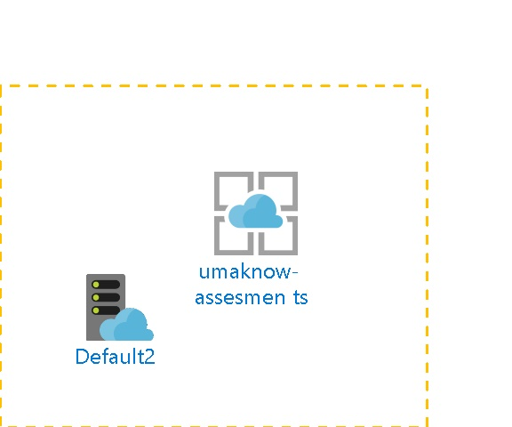

# umaknow-assesments 
  
## Settings

| Web Site State | Running  |
| --- | --- |
| Always On | False  |
| Load Balancing | LeastRequests  |
| Nb of workers | 1  |
| Auto Swap Slot Name |   |
| Enabled | True  |
| GatewaySiteName |   |
| Location | East US  |
| Outbound Ip Addresses | 23.96.33.205,23.96.34.196,23.96.35.20,23.96.36.229  |
| Premium App Deployed |   |
| Virtual Network Name |   |
| Repository Site Name | umaknow-assesments  |
| Scm Site Stopped | False  |
| Use 32 Bits Worker Process | True  |

## App Service Plan
 

| Service Plan Name |   |
| --- | --- |
| Application Service Environment |   |
| Geographical Location | East US  |
| Maximum Number Of Workers | 1  |
| Number Of Sites | 8  |
| Per Site Scaling enabled | False  |
| Status | Ready  |
| Sku Name | F1  |
| Sku Tier | Free  |
| Sku Family | F  |
| Sku Capacity | 0  |
| Sku Size | F1  |

## Tags

| Tag Key | Tag Value |
| --- | --- |
| hidden-related:/subscriptions/275ddf79-b240-44e7-9916-f24175b451b1/resourcegroups/Default-Web-EastUS/providers/Microsoft.Web/serverfarms/Default2  | Resource  |

## Site diagnostics
The site diagnostics options have been configured as follows.

| Request Tracing Enabled | False  |
| --- | --- |
| Detailed logging enabled | False  |
| Remote Debugging Enabled | False  |
| Remote Debugging Version | VS2012  |

## Functions
The following Functions are deployed in the App Service.
The following Proxies are deployed in the App Service.

## Default documents
The following default documents are defined.
- Default.htm

- Default.html

- Default.asp

- index.htm

- index.html

- iisstart.htm

- default.aspx

- index.php

- hostingstart.html

## Host Names
The following Host Names are defined.
- umaknow-assesments.azurewebsites.net

- umaknow-assesments.scm.azurewebsites.net

## Metrics

## Average Response Time
 
## Requests
 
## Architecture diagram
 

## Billing
 Total cost : 
