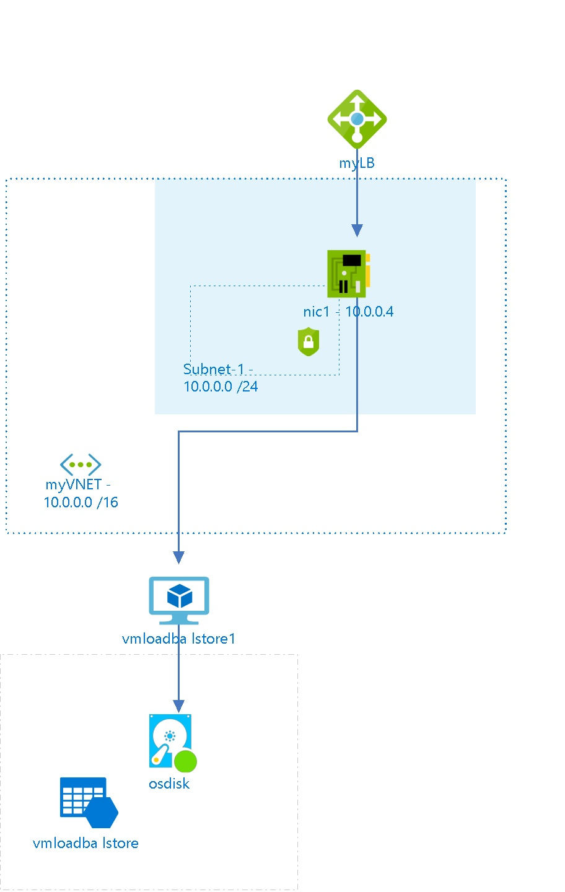

# vmloadbalstore1
 
## Settings
The virtual machine vmloadbalstore1 has the following settings:

| Name | vmloadbalstore1  |
| --- | --- |
| Operating System | WindowsServer  |
| Location | eastus  |
| Size | Standard_D1 <passthrough><ul><li>Number Of Cores : 1</li><li>Memory (MB): 3584</li><li>Max Data Disk Count: 4</li><li>OS Disk Size (MB) : 1047552</li><li>Resource Disk Size (MB) : 51200</li></ul></passthrough> |
| --- | --- |
| Availability Set | MYAVSET  |
| Fault Domain | 1  |
| Update Domain | 1  |
| State | VM deallocated  |
| Diagnostic Storage |   |
| Provisioning Date | 9/6/2017 4:20:08 AM  |
| Last Patch Date |   |
| Resource Group | [vmloadbalacanced](vmloadbalacanced--926519262.md)  |
| Auto Update Status |   |

## Tags

| Tag Key | Tag Value |
| --- | --- |
| ADK_Billing  | Quality Deparment  |
 
## Network interfaces

## nic1

### Settings

| Name | nic1  |
| --- | --- |
| Is primary | True  |
| Provisioning State | Succeeded  |
| Network Security Group |   |
| Enable IP Forwarding | False  |
| Location | eastus  |
| Mac Address |   |

### IP Configurations

| Public IP | Private IP | Subnet Name |
| --- | --- | --- |
|   | 10.0.0.4  | Subnet-1  |
 
## Load Balancers

## myLB

### Settings

| Name | myLB  |
| --- | --- |
| Location | eastus  |
| Provisioning State | Succeeded  |

### Inbound NAT Rules

| Name | Protocol | BackendPort | Front End Port | Enable Floating IP |
| --- | --- | --- | --- | --- |
| RDP-VM0  | Tcp  | 3389  | 50001  | False  |
| RDP-VM1  | Tcp  | 3389  | 50002  | False  |

## Virtual Disks
The Virtual Machine is using the following disks

## OS Hard Disks

| Name | VHD Uri | Size (GB) | Is Managed Disk | Host Caching |
| --- | --- | --- | --- | --- |
| osdisk  | http://vmloadbalstore.blob.core.windows.net/vhds/osdisk1.vhd  |   | False  | ReadWrite  |

## Metrics

## Processor Time
 
## Available Bytes
  

## Billing
 Total cost : 
