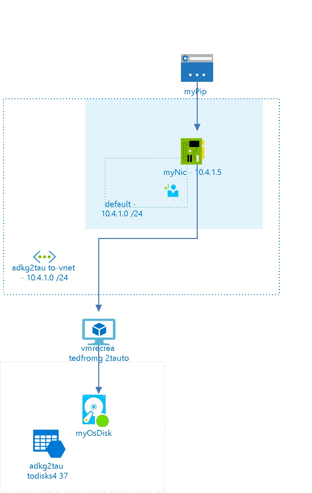

# vmrecreatedfromg2tauto
 
## Settings
The virtual machine vmrecreatedfromg2tauto has the following settings:

| Name | vmrecreatedfromg2tauto  |
| --- | --- |
| Operating System |   |
| Location | eastus2  |
| Size | Standard_D2_v2 <passthrough><ul><li>Number Of Cores : 2</li><li>Memory (MB): 7168</li><li>Max Data Disk Count: 8</li><li>OS Disk Size (MB) : 1047552</li><li>Resource Disk Size (MB) : 102400</li></ul></passthrough> |
| --- | --- |
| Availability Set |   |
| Fault Domain |   |
| Update Domain |   |
| State | VM deallocated  |
| Diagnostic Storage |   |
| Provisioning Date | 8/18/2017 6:10:33 PM  |
| Last Patch Date |   |
| Resource Group | [adkg2tauto](adkg2tauto-2034839542.md)  |
| Auto Update Status |   |

## Network interfaces

## myNic

### Settings

| Name | myNic  |
| --- | --- |
| Is primary | True  |
| Provisioning State | Succeeded  |
| Network Security Group |   |
| Enable IP Forwarding | False  |
| Location | eastus2  |
| Mac Address |   |

### IP Configurations

| Public IP | Private IP | Subnet Name |
| --- | --- | --- |
|   | 10.4.1.5  | default  |
 

## Virtual Disks
The Virtual Machine is using the following disks

## OS Hard Disks

| Name | VHD Uri | Size (GB) | Is Managed Disk | Host Caching |
| --- | --- | --- | --- | --- |
| myOsDisk  | https://adkg2tautodisks437.blob.core.windows.net/vhds/vmrecreatedfromg2tauto-myOsDisk.vhd  |   | False  | ReadWrite  |

## Metrics

## Processor Time
 
## Available Bytes
  

## Billing
 Total cost : 
